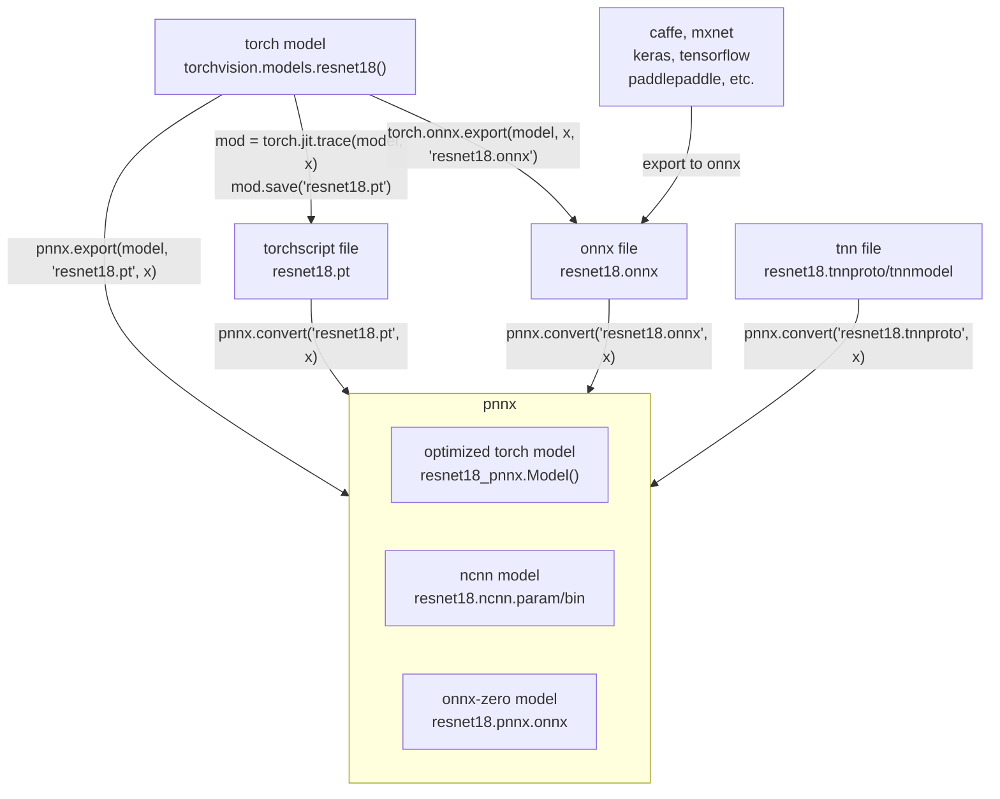

# pnnx


PyTorch Neural Network eXchange

Note: The current implementation is in https://github.com/Tencent/ncnn/tree/master/tools/pnnx

# What is pnnx

PyTorch Neural Network eXchange(PNNX) is an open standard for PyTorch model interoperability. PNNX provides an open model format for PyTorch. It defines computation graph as well as high level operators strictly matches PyTorch.

<table>
<tr>
<td>

* optimize torch model


</td>
<td>

* reduce extension package dependency


</td>
</tr>
<tr>
<td>

* convert torchscript / onnx back to python


</td>
<td>

* export to portable pnnx format / onnx-zero / ncnn


</td>
</tr>
</table>



# How to install pnnx

### ----- A. python pip (recommended)

* Windows/Linux/macOS 64bit
* python 3.7 or later

```shell
pip3 install pnnx
```

### ----- B. portable binary package (recommended if you hate python)

* Windows/Linux/macOS 64bit
* For Linux, glibc 2.17+

Download portable pnnx binary package from https://github.com/pnnx/pnnx/releases and extract it.

This package includes all the binaries required. It is portable, so no CUDA or PyTorch runtime environment is needed :)

<table>
<tr>
<td>
  
  <br /><b>Windows</b><br />
  <a href="https://github.com/pnnx/pnnx/releases/latest/download/pnnx-20240815-windows.zip">
    
  </a>
</td>
<td>
  
  <br /><b>Linux(x86_64)</b><br />
  <a href="https://github.com/pnnx/pnnx/releases/latest/download/pnnx-20240815-linux.zip">
    
  </a>
</td>
<td>
  
  <br /><b>Linux(aarch64)</b><br />
  <a href="https://github.com/pnnx/pnnx/releases/latest/download/pnnx-20240815-linux-aarch64.zip">
    
  </a>
</td>
<td>
  
  <br /><b>macOS(universal)</b><br />
  <a href="https://github.com/pnnx/pnnx/releases/latest/download/pnnx-20240815-macos.zip">
    
  </a>
</td>
</tr>
</table>

### ----- C. build from source

1. install pytorch
2. (optional) install torchvision for pnnx torchvision operator support
3. (optional) install protobuf for pnnx onnx-zero support
4. clone https://github.com/Tencent/ncnn.git
5. build pnnx in ncnn/tools/pnnx with cmake

You will probably refer https://github.com/pnnx/pnnx/blob/main/.github/workflows/release.yml for detailed steps

```shell
git clone https://github.com/Tencent/ncnn.git
mkdir ncnn/tools/pnnx/build
cd ncnn/tools/pnnx/build
cmake -DCMAKE_INSTALL_PREFIX=install -DTorch_INSTALL_DIR=<your libtorch install dir> -DTorchVision_INSTALL_DIR=<your torchvision install dir> ..
cmake --build . --config Release -j 4
cmake --build . --config Release --target install
```

# How to use pnnx

### ----- A. python

1. optimize and export your torch model with pnnx.export()

```python
import torch
import torchvision.models as models
import pnnx

model = models.resnet18(pretrained=True)

x = torch.rand(1, 3, 224, 224)

opt_model = pnnx.export(model, "resnet18.pt", x)

# use tuple for model with multiple inputs
# opt_model = pnnx.export(model, "resnet18.pt", (x, y, z))
```

2. use optimized module just like the normal one

```python
result = opt_model(x)
```

3. pick resnet18_pnnx.py for pnnx-optimized torch model
4. pick resnet18.ncnn.param and resnet18.ncnn.bin for ncnn inference

### ----- B. command line

1. export your torch model to torchscript / onnx

```python
import torch
import torchvision.models as models

net = models.resnet18(pretrained=True)
net = net.eval()

x = torch.rand(1, 3, 224, 224)

# You could try disabling checking when tracing raises error
# mod = torch.jit.trace(net, x, check_trace=False)
mod = torch.jit.trace(net, x)

mod.save("resnet18.pt")

# You could also try exporting to the good-old onnx
torch.onnx.export(net, x, 'resnet18.onnx')
```

2. pnnx convert torchscript / onnx to optimized pnnx model and ncnn model files

```shell
./pnnx resnet18.pt inputshape=[1,3,224,224]
./pnnx resnet18.onnx inputshape=[1,3,224,224]
./pnnx resnet18.tnnproto inputshape=[1,3,224,224]
```

macOS zsh user may need double quotes to prevent ambiguity

```shell
./pnnx resnet18.pt "inputshape=[1,3,224,224]"
```

For model with multiple inputs, use list

```shell
./pnnx resnet18.pt inputshape=[1,3,224,224],[1,32]
```

For model with non-fp32 input data type, add type suffix

```shell
./pnnx resnet18.pt inputshape=[1,3,224,224]f32,[1,32]i64
```

3. pick resnet18_pnnx.py for pnnx-optimized torch model
4. pick resnet18.ncnn.param and resnet18.ncnn.bin for ncnn inference

### ----- visualize pnnx with netron

Open https://netron.app/ in browser, and drag resnet18.pnnx.param or resnet18.pnnx.onnx into it.

### ----- compare inference result

Normally, you will get seven files

|||
|---|---|
|resnet18.pnnx.param|PNNX graph definition|
|resnet18.pnnx.bin|PNNX model weight|
|resnet18_pnnx.py|PyTorch script for inference, the python code for model construction and weight initialization|
|resnet18.pnnx.onnx|PNNX model in onnx format|
|resnet18.ncnn.param|ncnn graph definition|
|resnet18.ncnn.bin|ncnn model weight|
|resnet18_ncnn.py|pyncnn script for inference|

```shell
pip3 install ncnn
```

run inference script generated by pnnx and check if the outputs are close enough.

```shell
$ python resnet18_pnnx.py
tensor([[-1.5752e+00,  6.8381e-01,  1.4599e+00,  1.1986e+00,  1.0503e+00,
         -5.0585e-01,  9.1962e-01,  1.4127e-01, -1.2256e+00, -3.8200e-01,
          1.1840e+00,  2.5817e+00,  1.3319e+00,  2.8250e+00,  2.6328e+00,
          1.1827e+00,  1.6862e+00,  2.9742e-01,  1.5851e+00,  1.9562e+00,
          ...

$ python resnet18_ncnn.py
tensor([[-1.5719e+00,  6.8591e-01,  1.4592e+00,  1.1973e+00,  1.0503e+00,
         -5.0833e-01,  9.1693e-01,  1.4180e-01, -1.2239e+00, -3.8417e-01,
          1.1816e+00,  2.5768e+00,  1.3295e+00,  2.8196e+00,  2.6259e+00,
          1.1806e+00,  1.6830e+00,  2.9536e-01,  1.5808e+00,  1.9530e+00,
          ...
```

### ----- detailed options

```
Usage: pnnx [model.pt] [(key=value)...]
  pnnxparam=model.pnnx.param
  pnnxbin=model.pnnx.bin
  pnnxpy=model_pnnx.py
  pnnxonnx=model.pnnx.onnx
  ncnnparam=model.ncnn.param
  ncnnbin=model.ncnn.bin
  ncnnpy=model_ncnn.py
  fp16=1
  optlevel=2
  device=cpu/gpu
  inputshape=[1,3,224,224],...
  inputshape2=[1,3,320,320],...
  customop=/home/nihui/.cache/torch_extensions/fused/fused.so,...
  moduleop=models.common.Focus,models.yolo.Detect,...
Sample usage: pnnx mobilenet_v2.pt inputshape=[1,3,224,224]
              pnnx yolov5s.pt inputshape=[1,3,640,640]f32 inputshape2=[1,3,320,320]f32 device=gpu moduleop=models.common.Focus,models.yolo.Detect
```

|paramter|default value|description|
|:---:|:---:|:---|
|model.pt<br>model.onnx<br>model.tnnproto|**(required)**|The torchscript / onnx / tnn file path|
|pnnxparam|*.pnnx.param<br />(\* is the model name)|PNNX graph definition file|
|pnnxbin|*.pnnx.bin|PNNX model weight|
|pnnxpy|*_pnnx.py|PyTorch script for inference, including model construction and weight initialization code|
|pnnxonnx|*.pnnx.onnx|PNNX model in onnx format|
|ncnnparam|*.ncnn.param|ncnn graph definition|
|ncnnbin|*.ncnn.bin|ncnn model weight|
|ncnnpy|*_ncnn.py|pyncnn script for inference|
|fp16|1|save ncnn weight and onnx in fp16 data type|
|optlevel|2|graph optimization level<br />0 = do not apply optimization<br />1 = optimize for inference<br />2 = optimize more for inference|
|device|cpu|device type for the input in torchscript model, ignored for onnx model, cpu or gpu|
|inputshape|*(optional)*|shapes of model inputs. It is used to resolve tensor shapes in model graph. for example, `[1,3,224,224]` for the model with only 1 input, `[1,3,224,224],[1,3,224,224]` for the model that have 2 inputs.<br />shape tuple can be optionally decorated by a typename, like `[1,3,224,224]f32` for float32 type.<br />f32 = torch.float32 or torch.float<br />f64 = torch.float64 or torch.double<br />f16 = torch.float16 or torch.half<br />u8 = torch.uint8<br />i8 = torch.int8<br />i16 = torch.int16 or torch.short<br />i32 = torch.int32 or torch.int<br />i64 = torch.int64 or torch.long<br />c32 = torch.complex32<br />c64 = torch.complex64<br />c128 = torch.complex128<br />|
|inputshape2|*(optional)*|shapes of alternative model inputs, the format is identical to `inputshape`. Usually, it is used with `inputshape` to resolve dynamic shape (-1) in model graph.|
|customop|*(optional)*|list of Torch extensions (dynamic library) for custom operators, ignored for onnx model, separated by ",". For example, `/home/nihui/.cache/torch_extensions/fused/fused.so,...`|
|moduleop|*(optional)*|list of modules to keep as one big operator, ignored for onnx model, separated by ",". for example, `models.common.Focus,models.yolo.Detect`|

